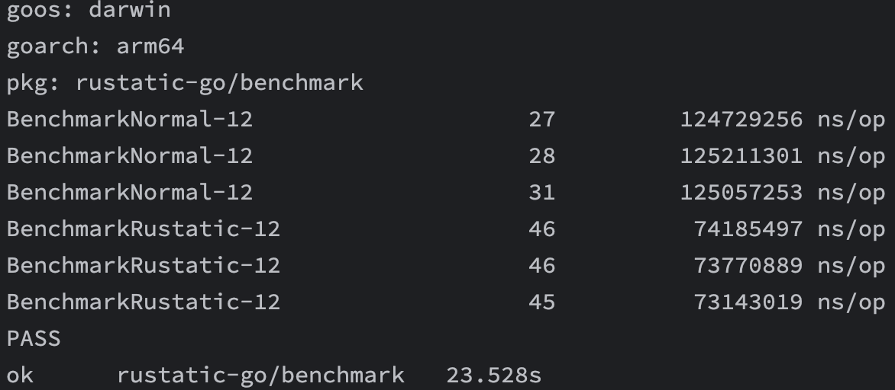
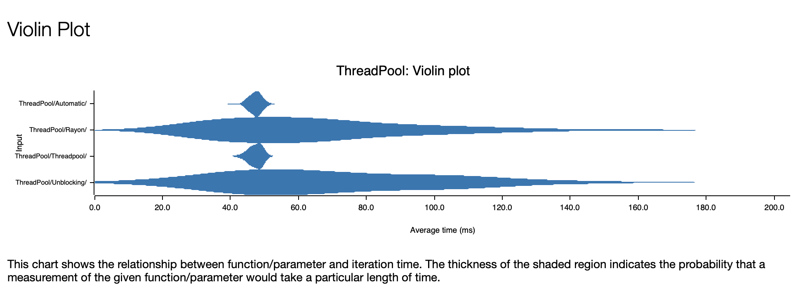
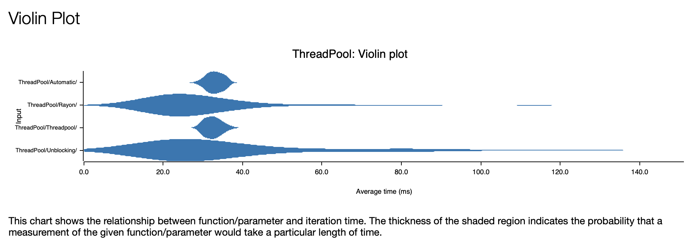
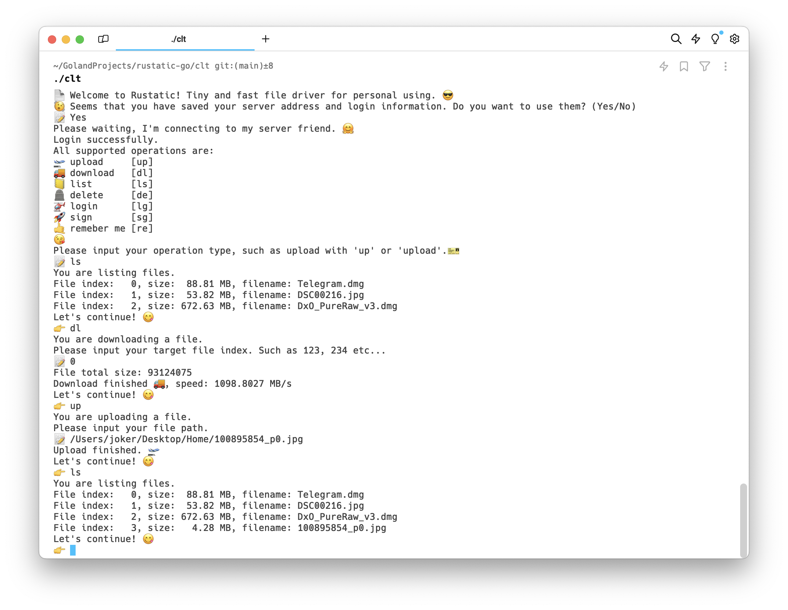

用法：

直接编译运行 clt目录即可。

首先是性能对比：

大约提升了41%的性能，考虑到cache buffer预热之后，属于纯内存拷贝操作，符合预期。

### 为什么做这个

之前做了一个纯静态的网站，因为上面放的是自己摄影的作品，想要一个保存图片的功能，于是想着自己做一个小图床，但是后来觉得既然做，就索性追求性能好了。

#### 设计

考虑到主要的功能都是静态文件操作，所以想要提升性能，就要从“不必要的操作”下手。毕竟在磁盘性能固定，带宽都一样拉的情况下，减少服务端的活就成了近乎唯一的选择，当然客户端也需要，但收益就小了很多。

在服务端想做到静态文件上传，似乎没什么好的做法，就是纯粹的读取，写入，无非设置buffer大小这种炼丹级别的做法。后来也有调查过Linux文件预分配，之后使用`mmap`进行减少拷贝，考虑到上传是一次操作，所以为了减少开发难度，决定暂时搁置。

但是文件下载则是一个值得考究的问题，因为有零拷贝`zero-copy`技术可以用。

在文件下载的选择上，有`mmap`、`splice`、`sendfile`三种选择。

首先是`mmap`，对用户空间和内核空间映射，减少一次内核到用户的拷贝。

之后是`splice`，直接建立文件FD与SocketFD之间的管道，减少内核到用户，cache buffer到Socket buffer两次拷贝。

最后是我们选择的`sendfile`。它可以减少一次内核到用户的拷贝，如果DMA支持的话，甚至可以减少内核之间的拷贝(cache buffer -> socker buffer)。

为什么不选择`mmap`呢？因为会引入多一次的系统调用，在`mmap`之后，还需要调用`write`进行写入。其次呢，`mmap`更加复杂，有更多的参数需要设置。

`mmap`更适合内存共享，而`sendfile`天然适合文件传输，尤其是大文件。

至于`splice`，首先是不方便，然后是不如`sendfile`稳定，这点在网上可以找到Linus的回复，并且`StackOverflow`有一些论证，表明它是不建议使用的。

为什么不用`io_uring`？

因为不方便。在Rust中使用`io_uring`首先就是库不成熟，各大运行时都有自己的实现，但更多像打补丁似的兼容实现，性能是个问题。但是更重要的是，`io_uring`的文件操作并不全是类似IOCP那种全异步的实现，内部也是线程池实现，介于此(复杂的使用和并不完美的文件操作)，最终决定放弃。

既然确定了技术方案，剩下的就是搭建了。

首先使用两个TCP连接去处理，一个当作控制连接，一个数据连接，为什么不用UDP？是因为`sendfile`需要文件FD作为目标，而UDP无连接的特性不支持。

其次两个连接方便分别处理，隔离出来专门的数据路和请求路。

在监控Socket读写之后，需要把实际的文件读写放到线程处理，因为阻塞Reactor会导致后续所有其他连接被阻塞。目前Rust异步运行时均为此模型，所以就引入了线程池的使用。

整体逻辑为：

- 双连接建立，控制连接生成标识符，用户发送标识符到数据连接，进行二者的配对。
- 用户请求控制连接，产生的数据或者需要接收的数据通过数据连接发送和接收。

既然需要使用线程池去处理数据连接产生的文件读写，选择一个或者设计一个线程池就显得很有必要了。

其中Automatic是为了此项目设计的线程池，Unblocking则是smol旗下的，还有经典的Threadpool以及Rayon。

第一张图是对于固定耗时5微秒的任务执行情况，第二张图则是纯粹的调度对比。

均为1024个异步Task，每个10次调用，可以看到Automatic还是很强劲的。

其内部使用了ThreadLocal技术，外加TaskStealing进行合理的任务分配。

有了上述设计，便可以设计用户交互的接口了。

#### UI设计

这里采用终端交互的形式，包括登陆，注册，上传，下载，列表等操作。

[项目地址](https://github.com/SuanCaiYv/rustatic)

